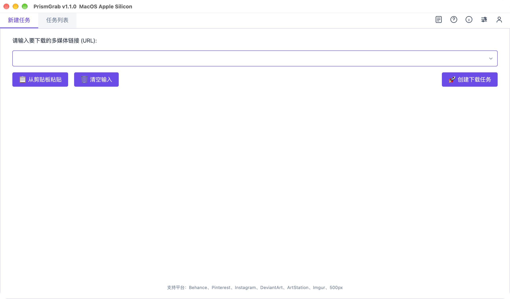
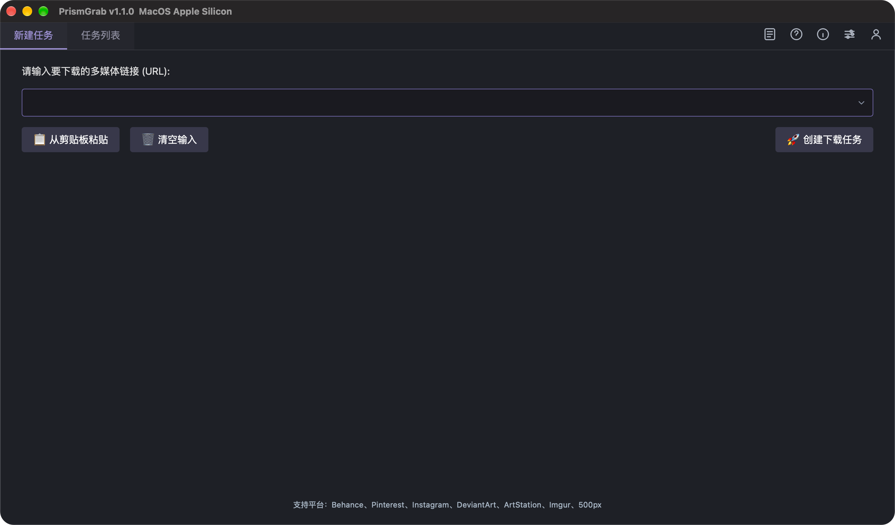
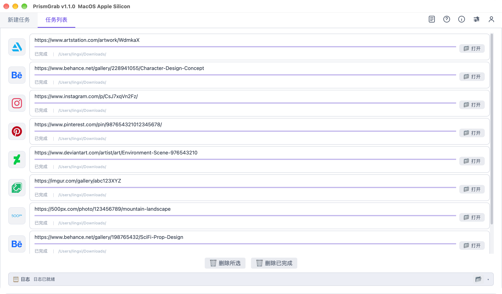
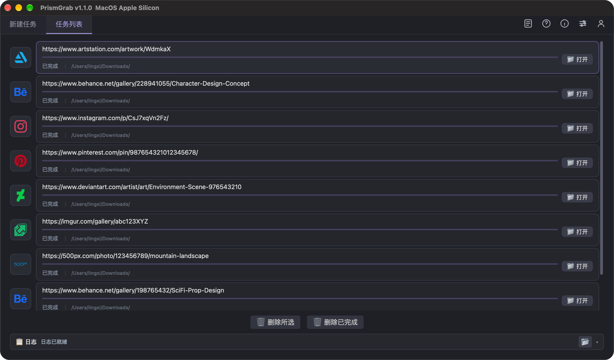
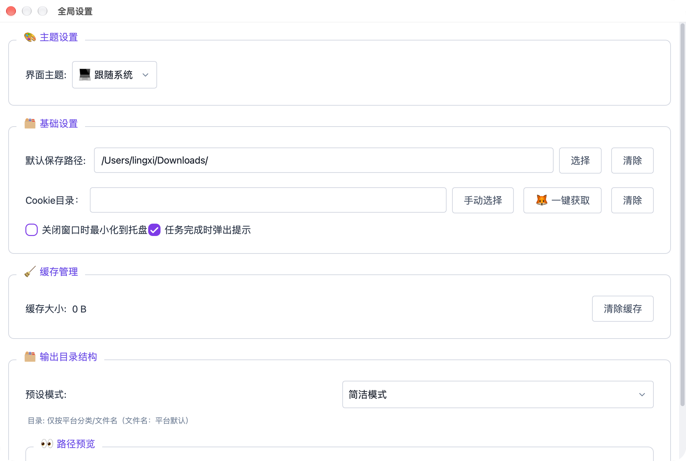
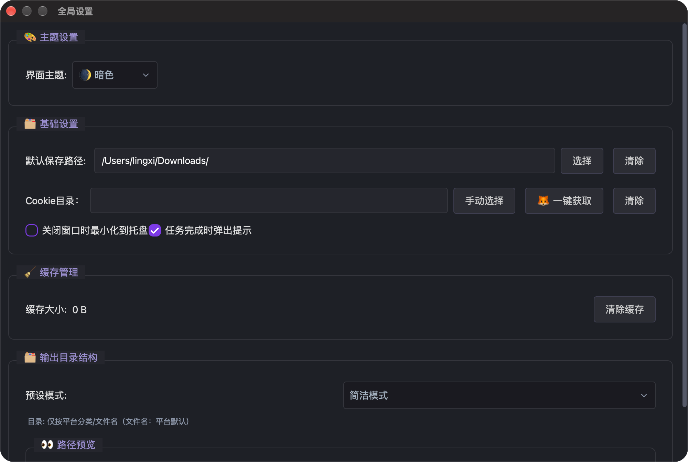

# PrismGrab

<p align="center">
  
</p>

<p align="center">
  <strong>一款高效、易用的海外网站图片素材批量下载工具</strong><br>
  内置高性能图片解析引擎，支持主页、作品合集、收藏夹等图集一键批量下载
</p>

<p align="center">
  
  
  
  
</p>

---

## 🖼️ 界面预览

**新建任务**（左：浅色主题，右：暗色主题）：

<p align="center">
  
  
</p>

**任务列表**（卡片式任务 + 平台 Logo）：

<p align="center">
  
  
</p>

**全局设置**：

<p align="center">
  
  
</p>

## ✨ 功能特性

### 核心下载
- **一键批量下载**：粘贴图库 / 作品 / 合集 / 收藏夹链接，自动解析并下载全部图片素材
- **卡片式任务列表**：平台 Logo + 实时速度、剩余时间、文件计数，随时停止（1-2 秒内生效）、Ctrl/Shift 多选删除
- **一键重试**：失败 / 中断任务原行重试，已下载部分自动跳过、只补缺失文件
- **失败原因直读**：失败任务标明具体原因与建议（需要登录 / 限流 / 内容失效 / 网络问题等）
- **任务记忆**：任务列表自动持久化，重启软件后不丢失（中断任务显示最后进度）
- **受限内容**：通过导入网站 Cookie 下载登录可见、会员可见的内容
- **内嵌视频**：可抓取部分网页内嵌视频（如 Behance 内嵌的 Vimeo 视频），自动调用内置 FFmpeg 合并分段视频
- **断点容错**：下载中自动跳过已存在文件，失败任务自动记录状态

### 目录整理
- **5 种预设模板**：完整结构 / 简洁模式 / 按作者整理 / 按日期整理 / 扁平模式
- **自定义模板**：支持 `{category}`、`{user_name}`、`{date}`、`{title}`、`{id}` 等变量与 `|` 回退语法，实时预览落盘路径

### 使用体验
- **最近链接**：输入框下拉最近 20 条下载历史，可单条删除
- **界面主题**：跟随系统 / 亮色 / 暗色三态切换，无需重启
- **最小化到托盘**：关闭窗口后台继续下载，任务完成 / 失败弹系统气泡通知
- **在线更新**：启动后台自动检查新版本，应用内直接下载升级包完成更新，软件内可离线查看更新日志
- **中文界面**：内置 Qt 官方翻译，右键菜单、系统弹窗等全部本地化

## 🌐 支持平台

| 平台 | 链接类型 |
|------|---------|
| Behance | 作品、作品集、用户主页、收藏夹 |
| Pinterest | 图板、用户主页 |
| Instagram | 帖子、用户主页（受限内容需 Cookie） |
| DeviantArt | 作品、图库 |
| ArtStation | 作品、用户主页 |
| Imgur | 帖子、用户主页 |
| 500px | 作品、用户主页 |

> 完整适配清单与示例链接请查看 [支持站点列表](https://www.aizzx.top/1741.html)。

## 📦 下载安装

前往 [GitHub Releases](https://github.com/zlingxi/PrismGrab/releases) 或 [官方发布页](https://www.aizzx.top/1741.html) 下载对应平台的最新安装包：

| 平台 | 安装包 |
|------|--------|
| Windows x64 | `PrismGrab vx.x.x Windows x64.exe` |
| macOS Apple Silicon | `PrismGrab vx.x.x Mac aarch64.dmg` |
| macOS Intel | `PrismGrab vx.x.x Mac intel x64.dmg` |

- **Windows**：双击运行安装包，按向导完成安装（需管理员权限）
- **macOS**：挂载 `.dmg` 镜像，将 PrismGrab 拖入 Applications 完成安装

## 🍎 macOS 支持

PrismGrab 完整支持 **Apple Silicon（M 系列芯片）** 与 **Intel 芯片** 两大架构，两种芯片均提供独立的原生安装包，无需 Rosetta 转译：

| 芯片架构 | 适用机型 | 安装包 |
|---------|---------|--------|
| Apple Silicon（arm64） | M1 / M2 / M3 / M4 系列及后续机型 | `PrismGrab vx.x.x Mac aarch64.dmg` |
| Intel（x86_64） | 2020 年及更早的 Intel 芯片 MacBook / iMac | `PrismGrab vx.x.x Mac intel x64.dmg` |

**确认自己的芯片类型**：点击屏幕左上角  → 关于本机，查看"芯片"或"处理器"一栏：显示 `Apple M1/M2/M3/M4` 为 Apple Silicon，显示 `Intel` 则选择 Intel 版本；也可以在终端执行 `uname -m`，输出 `arm64` 选 Apple Silicon 版，输出 `x86_64` 选 Intel 版。

**安装步骤**：

1. 下载与芯片架构对应的 `.dmg` 安装镜像
2. 双击挂载镜像，将 **PrismGrab** 拖入 **Applications（应用程序）** 文件夹
3. 从启动台或应用程序目录启动 PrismGrab

**常见问题**：

- **提示"无法验证开发者"或"无法打开，因为无法确认开发者"**：在应用程序目录中**右键点击 PrismGrab → 打开**，在弹窗中再点击"打开"即可；此后可正常启动
- **提示"PrismGrab 已损坏，无法打开"**：这是系统对未公证应用的拦截，打开终端执行以下命令后重新打开即可：

  ```bash
  sudo xattr -rd com.apple.quarantine /Applications/PrismGrab.app
  ```

- **系统版本要求**：请确保 macOS 版本满足最低运行要求（建议 macOS 11 Big Sur 及以上）

## 🚀 快速开始

1. 打开 **设置**，按习惯配置保存路径、Cookie 目录与输出目录结构
2. 复制目标图库 / 作品链接，粘贴至主页输入框
3. 点击 **🚀 创建下载任务**，等待资源抓取完成


## 🍪 Cookie 说明

下载登录可见、会员等受限内容时需要导入对应网站的 Cookie：

1. 浏览器登录目标网站后，导出 Cookie 为 `Netscape` 格式的 `.txt` 文件
2. 将 `.txt` 文件放入同一目录（**文件名随意**，软件会自动识别内容中包含哪个平台的 Cookie；也可以用浏览器插件导出一个包含所有站点的混合文件）
3. 在 **设置 → Cookie 目录** 中选择该目录（或使用 **一键获取**），下载时会自动匹配对应站点

> 💡 推荐：装了 Firefox 浏览器的用户可直接使用一键获取，无需手动导出。规范命名（如 `instagram.txt`）会被优先采用。

详细操作教程见 [Cookie 配置教程](https://www.aizzx.top/1741.html)。

## 📁 输出目录结构

| 预设模式 | 目录结构 |
|---------|---------|
| 默认（完整结构） | `平台/作者/日期_标题/文件名` |
| 简洁模式 | `平台/文件名` |
| 按作者整理 | `authors/作者/平台/文件名` |
| 按日期整理 | `年/月/平台/文件名` |
| 扁平模式 | `文件名`（无子目录） |
| 自定义 | 任意组合模板 |

自定义模板可用变量：

| 变量 | 含义 |
|------|------|
| `{category}` | 平台名 |
| `{user_name\|username\|user[name]}` | 作者（支持 `\|` 回退语法） |
| `{date:%Y%m%d}` | 日期（支持格式化） |
| `{title\|name\|text}` | 标题 |
| `{id}` | 作品 ID |
| `{extension}` | 文件扩展名 |

示例：`{category}/{user_name}/{date:%Y-%m-%d}_{title}.{extension}`

## 🔑 激活说明

- 软件采用卡密激活制，激活后绑定设备使用
- 每年可自助解绑换机 **3 次**（个人中心 → 解绑换机）
- 获取渠道：[商城购买](https://www.aizzx.top/shop/1737.html)（优惠打折）或 [自助下单](https://api.aizzx.top/index/buy/CardBuyView/appid/4/index.html)

## 🔄 软件更新

- 启动时自动在后台检查新版本，发现新版本会在首页提示
- 支持应用内直接下载更新包并引导安装，也可前往 [发布页](https://www.aizzx.top/1741.html) 手动下载替换安装

## ❓ 常见问题

**Q：下载速度慢、任务频繁失败？**
检查代理网络连通性，更换线路稳定、IP 纯净的代理节点，静态住宅代理效果更好。

**Q：下载的图片保存在哪里？**
- Windows：默认保存至 `C:\Users\您的用户名\Downloads\PrismGrab` 目录。
- MacOS：默认保存至 `~/Downloads/PrismGrab` 目录。
- 可在设置中自定义保存路径与目录结构。

**Q：软件出现 bug 或功能异常，如何反馈？**
- 通过 [官方反馈渠道](https://www.aizzx.top/1741.html) 提交或评论问题描述。
- 通过 [GitHub发布页](https://github.com/zlingxi/PrismGrab/issues) 提交Issues

**Q：需要完整、稳定的视频下载能力？**
- PrismGrab 定位为图片、图集批量下载，虽然可以解析下载 **部分** 内嵌不同平台的视频文件，但是解析、下载均存在局限，不一定完全百分百可以下载视频。
- 纯粹的视频下载需求，更推荐使用专用工具 [VideosDown](https://www.aizzx.top/VideosDown)。

更多问题请打开软件内 **帮助**、 **官方网站**、 **GitHub发布** 页面查看。


## 📄 许可协议

本软件遵循《PrismGrab 软件最终用户许可协议（EULA）》分发，完整条款见 [LICENSE.md](LICENSE.md)。要点：

- 本软件为**专有软件**，版权归开发者所有
- 未经授权，禁止复制、分发本软件，禁止反向工程、绕过授权校验
- 获得书面源码授权的用户可在约定范围内进行二次开发，成果不得对外分发
- 软件所依赖的第三方开源组件遵循其各自的原始许可，详见协议附表